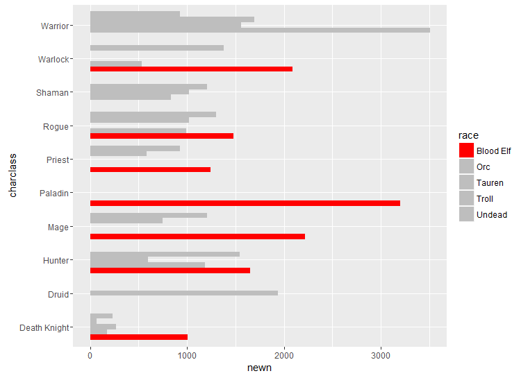

# Data Visualization using R (WoW Dataset)
Data visualization for [World of Warcraft dataset](https://www.kaggle.com/mylesoneill/warcraft-avatar-history) using R.  I ran into this dataset when I first started playing with machine learning 2-2.5 years ago.  I used the dataset to explore the R language.   

