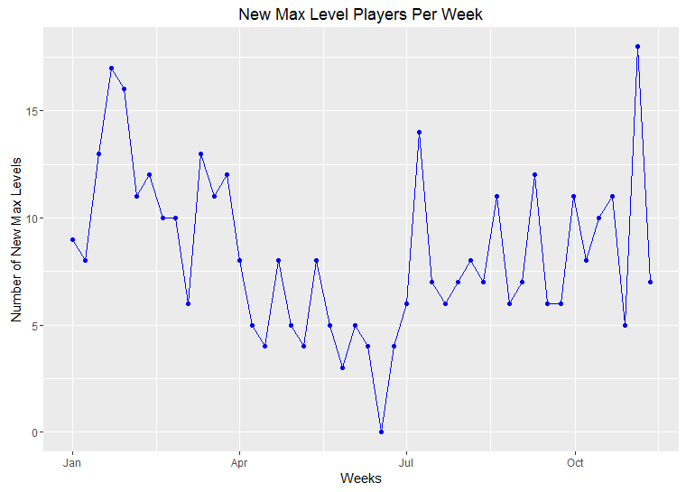
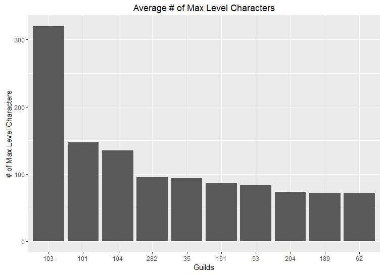

# Data Visualization using R (WoW Dataset)
Data visualization for [World of Warcraft dataset](https://www.kaggle.com/mylesoneill/warcraft-avatar-history) using R.  I ran into this dataset when I first started playing with machine learning 2-2.5 years ago.  I used the dataset to explore the R language.   

## Initial Processing
Originally went through the data in the beginning portion of the code to check what is missing and how I could use the data.  I knew quite a bit about this time frame in World of Warcraft, so I tried to come up with different graphs of content which I found interesting.
The graphs follow the code as you are going down the main script.

## Data Visualization

### # of New Max Level Players per Week over a Years time
I found this to be particularly interesting due to showing a trend when people tend to level up new characters.  The trend seems to follow the school calendar (which isn't surprising considering the average age group for these type of games).

### Race/Class Combo (with focus on Blood Elf Race)
Blood Elf's were always my favorite race in this game, so I wanted to see how many people shared my enthusiasm for them.  You can see from the graph, the Blood Elfs reign supreme in terms of race played.   

### Guilds - Average # of Max Level Characters (Top 10)
It's safe to say the more max level characters you have in your guild, the higher chance of success for your guild (usually).  This graph shows the top 10 guilds (each guild was assigned a number to replace the name) in terms of # of max level characters.  

