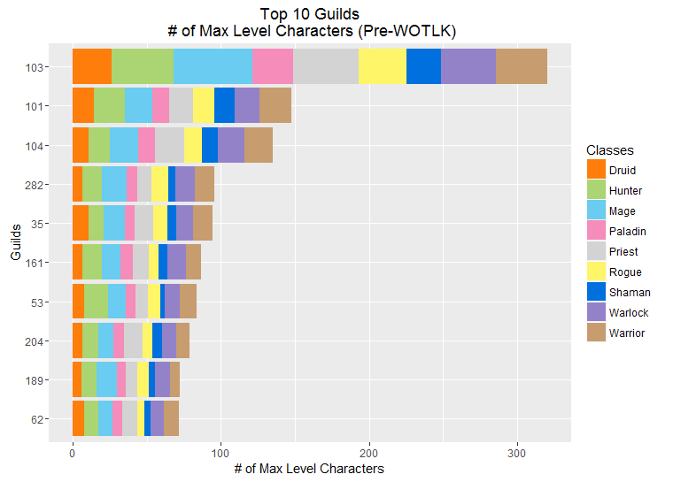
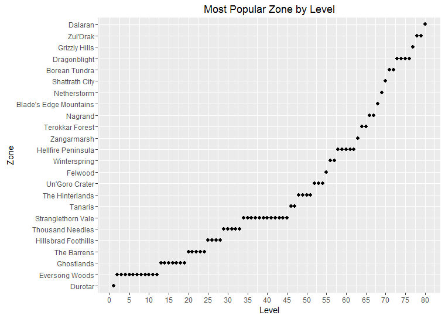
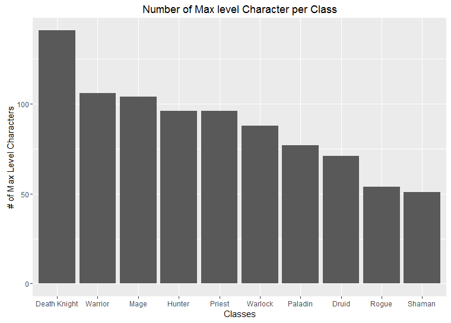
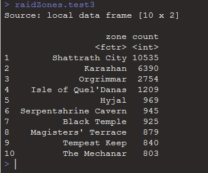

# Data Visualization using R (WoW Dataset)
Data visualization for [World of Warcraft dataset](https://www.kaggle.com/mylesoneill/warcraft-avatar-history) using R.  I ran into this dataset when I first started playing with machine learning 2-2.5 years ago.  I used the dataset to explore the R language.   

## Initial Processing
Originally went through the data in the beginning portion of the code to check what is missing and how I could use the data.  I knew quite a bit about this time frame in World of Warcraft, so I tried to come up with different graphs of content which I found interesting.
The graphs follow the code as you are going down the main script.

## Data Visualization

### # of New Max Level Players per Week over a Years time
I found this to be particularly interesting due to showing a trend when people tend to level up new characters.  The trend seems to follow the school calendar (which isn't surprising considering the average age group for these type of games).

### Race/Class Combo (with focus on Blood Elf Race)
Blood Elf's were always my favorite race in this game, so I wanted to see how many people shared my enthusiasm for them.  You can see from the graph, the Blood Elfs reign supreme in terms of race played.   

### Guilds - # of Max Level Characters (Top 10)
It's safe to say the more max level characters you have in your guild, the higher chance of success for your guild (usually).  This graph shows the top 10 guilds (each guild was assigned a number to replace the name) in terms of # of max level characters.  You can see the top guild completely dominates all in this category.  

### Guilds - Distribution of Classes per Guild (Top 10)
After seeing the # of max level char in each of the top guilds, I felt we needed a breakdown of how each of the classes were represented.  A good guild will have a well balanced distribution of classes.  From the data, you can see all the top guilds have a pretty solid distribution of classes.

### Most Popular Leveling Locations
Next, I wanted to explore how people were achieving max level by plotting the location people spent the most time at per level.  The data below can be interpreted one of two ways.  One, it could be used to find locations where people do not want to go because they prefer non-crowded locations, or it can be the opposite (more people to adventure with).

### # of Max Levels per Class
Next, I wanted to see the popularity of each class in the general population.  I found the # of max level characters per class and graphed them.  You can see Death Knight is by far the favorite class amongst players (which makes sense due to this class being new in the expansion).

### Where Max Level Chars Spend Their time
Once you have achieved max level, then the end game starts.  I wanted to see where each character was spending most of their time once they hit max level.  You can see from the data, the majority of people are spending time in the main city hub.  When they are not at the city hub, then they are out and about destroying dungeons and raid dungeons.

## Conclusion
This data set was fun to play with to relive parts of my childhood in a game I spent WAY to much time on.  It helped me learn to manipulate and graph in R.  As fun as R was to code in, I have since switched to python as my primary language of choice for data science.  However, it is useful to still know for reading other people's code.
